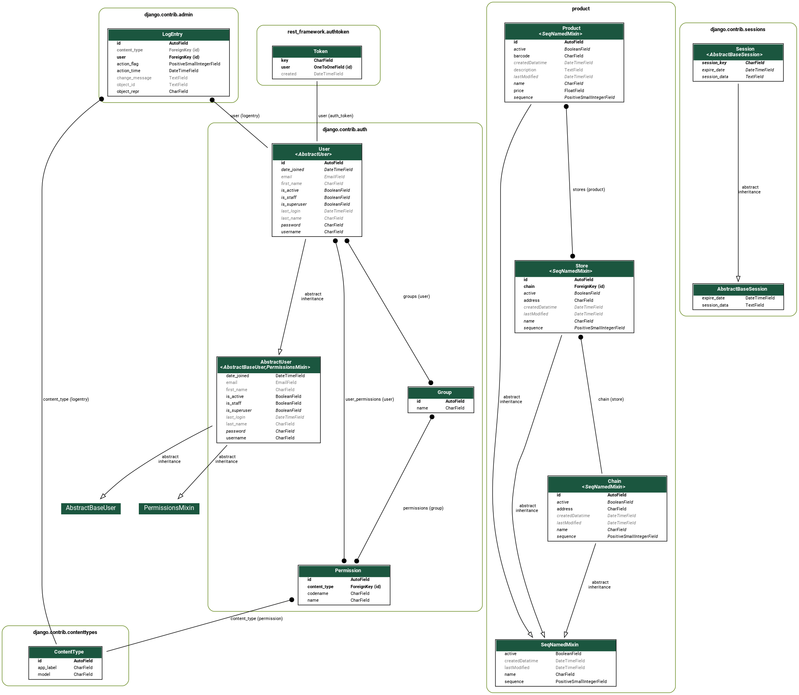

# datagram
datagram test

Install
--------

    $ python3.7 -m venv _env
    $ . _env/bin/activate
    $ cd datagramApp
    $ pip install -r requirements.txt
    $ python manage.py migrate
    $ python manage.py createsuperuser

Run
---
To run the application

    $ python manage.py runserver

Django Admin
------------
The application is hosted freely by pythonanywhere.com
at this link
https://khchine5.pythonanywhere.com/admin

API
---
The API are created thanks to https://www.django-rest-framework.org/
The API endpoints are availables only for authenticated users.

API are available at
https://khchine5.pythonanywhere.com/api/

Database Schema:
----------------
The following schema has been generated using django-extensions package.

React interface
---------------

https://react-datagram.vercel.app/